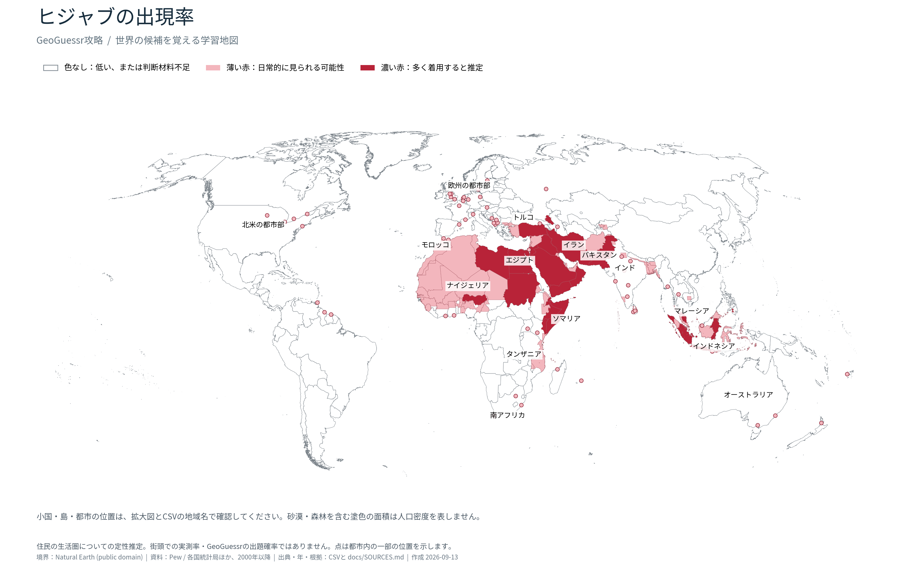

# GeoGuessr攻略

地図上の位置と結び付けて覚える、GeoGuessrの自主学習資料です。第一弾は**「ヒジャブの出現率」**。98の国・統計地域について、156の学習項目を収録しています。

**これは、資料から作った定性的な候補表です。ヒジャブ着用者の街頭出現率を世界共通の方法で測った統計ではありません。** 宗教人口の割合、女性の服装調査、地域についての推定を区別しています。



## 学習用ファイル

| 内容 | ファイル |
|---|---|
| 詳細一覧表・156項目（UTF-8 BOM付きCSV） | [ヒジャブの出現率.csv](output/ヒジャブの出現率.csv) |
| 世界図（画像） | [PNG](output/ヒジャブの出現率_世界地図.png) / [拡大できるSVG](output/ヒジャブの出現率_世界地図.svg) |
| 世界図＋地域別拡大図＋インド拡大図 | [10ページの地図帳PDF](output/ヒジャブの出現率_地図帳.pdf) |
| 出典と各資料の適用範囲 | [出典一覧](docs/SOURCES.md) |
| 判定・白色・地図境界の意味 | [作成方法と限界](docs/METHODOLOGY.md) |

CSVの最初の5列が暗記用です。後ろに、地域ID、地図番号、塗色範囲の種類、統計の地域名と年、服装についての根拠、出典を付けています。数値列は**ムスリム人口比率**であり、「その割合の女性がヒジャブを着ける」という意味ではありません。

地図の濃い赤は「多くの住民女性が着用すると推定」、薄い赤は「日常的に見られる可能性がある」という学習上の判定です。白色には、低頻度と考えられる場所のほか、十分な判定材料を得られなかった場所も含まれます。市内の一部だけを挙げた62項目は点で示し、市全域を塗っていません。

## 覚えるときの注意

- 最初に国・大まかな地域を候補にし、道路、言語、植生、建物などと組み合わせて絞ります。服装だけで個人の宗教や国籍を断定できません。
- 「その地域で見かける可能性」と「見かけたときにその国である確率」は別です。後者にはプレイするマップの収録国、Street Viewの撮影範囲・年、地点の選び方が影響します。本資料は公式車載映像の収録国だけに限定していません。
- 頭巻き、サリー・ドゥパッタの頭布、シク教徒やキリスト教徒の頭布、ニカブ、ブルカを自動的にヒジャブへまとめません。資料が頭布全般を尋ねた場合は、その制限を記載しています。
- インドのコジコードの旧英語名は**カリカット (Calicut)**。東部のコルカタの旧名**カルカッタ (Calcutta)**とは別です。
- ナイジェリア北部にも宗教の混在があります。南西部にもムスリムが多く住み、「北部全員がムスリム」「見かけたら必ず北部」とはしません。

## 帝国書院の白地図について

依頼された帝国書院版は、同じ地域データを使って**ローカルの個人学習用**に生成しました。帝国書院の[利用案内](https://www.teikokushoin.co.jp/faq/)から、公開GitHubでの原図・加工図の再配布を許すライセンスは確認できませんでした。そのため、原図と加工図は `local-only/` / `.cache/` に置き、Gitの対象から除外しています。

このリポジトリには、[パブリックドメインのNatural Earth](https://www.naturalearthdata.com/about/terms-of-use/)を白地図とする公開版を収録しています。帝国書院版の投影設定と塗色座標も保存済みです。これらは独立したNatural Earthの形状に基づく座標で、出版社の原図をトレースしたデータではありません。

## 更新・再生成

Python 3.12を推奨します。公開版の再生成に元の報告書全文は不要です。

```sh
python3 -m venv .venv
.venv/bin/python -m pip install -r requirements.txt
.venv/bin/python scripts/fetch_assets.py
.venv/bin/python scripts/build.py
```

最初のダウンロードは、描画に使うOFLライセンスの日本語フォントです。資料と境界データの版は固定し、入力のSHA-256も保存しています。更新方法、元統計からの再抽出、帝国書院版の再生成は [REPRODUCING.md](docs/REPRODUCING.md) を参照してください。

## 保存しているデータ

| ファイル | 内容 |
|---|---|
| `data/study_regions.geojson` | 塗色した94範囲と62の点。WGS84、経度・緯度の順 |
| `data/region_definitions.json` | 国全域・行政区名・概略ポリゴン・点の指定 |
| `data/study_regions.json` | 地域、判定、統計、根拠を結んだ詳細情報 |
| `data/teikoku_calibration.json` | 原図の画像サイズ、投影、ピクセル変換、基準点、原図ハッシュ |
| `data/teikoku_pixel_regions.json` | 帝国書院版の塗色範囲をピクセル座標で表した独自データ |
| `data/national_religion_2010_2020.csv` | Pewの201か国・地域の2010/2020年推計と世界・広域集計 |
| `data/india_religion_2011.csv` | インド全国・州および取得した7州・直轄領の地区統計 |
| `data/indonesia_provinces_2010.csv` | インドネシア33州と全国の宗教人口・女性人口 |
| `data/sri_lanka_districts_2024.csv` | スリランカ25地区と全国の宗教人口比率 |
| `data/clothing_surveys.csv` | 服装調査の数値。質問・分母・年を分離 |
| `data/manual_statistics.csv` | その他の地域の手作業で確認した数値と分母 |
| `data/country_coverage.csv` | 国連M49の国・統計地域ごとの掲載有無。未掲載は不在の証明ではない |

非公式の自主学習プロジェクトです。GeoGuessr、Google、帝国書院、統計資料の発行機関との提携・公認を示すものではありません。権利の整理は [LICENSES.md](docs/LICENSES.md) に記載しています。
