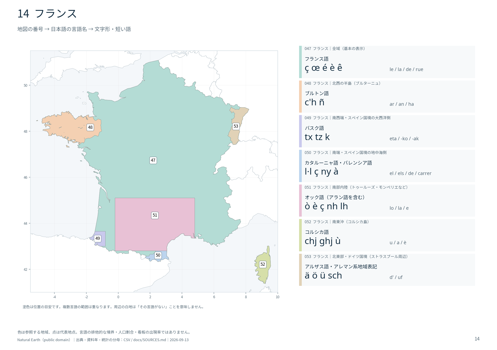

# ヨーロッパ周辺の特徴的な文字形

国の基本表示と、地域ごとの併記言語を結び付けて覚えるGeoGuessr用の地図帳です。**56の国・統計地域、179の位置、232の言語・地域の組合せ**を収録しました。資料確認：2026年9月13日。

| 学習用ファイル | 内容 |
|---|---|
| [地図帳PDF](output/ヨーロッパ周辺の特徴的な文字形_地図帳.pdf) | 46ページ。世界の対象範囲、文字の比較早見表、地域別拡大図。日本語名と字形を大きく表示 |
| [詳細一覧CSV](output/ヨーロッパ周辺の特徴的な文字形.csv) | 232行、UTF-8 BOM付き。地域、公的地位、字形、短い語、混同注意、出典、座標 |
| [全ページの目次](docs/ATLAS_INDEX.md) | ページごとのPNGへ移動 |
| [文字比較の早見表](output/atlas_02.png) | `ø / ö`、`ř / ľ`、`ћ / ќ`など12組。拡大用の[SVG](output/atlas_02.svg)も収録 |
| [出典台帳](docs/SOURCES.md) | 国連提出の地名表記資料、各国の統計・自治体資料、Unicodeなど |
| [作成方法](docs/METHODOLOGY.md) / [再生成手順](docs/REPRODUCING.md) | 収録範囲、例外、数値の読み方、将来の更新方法 |

CSVの最初の8列を暗記用に使い、地図番号・ページで位置を確認できます。後半には資料ID、出典URL、統計との対応、大文字形を付けています。`de` や `la` など共有される語も載せ、単独では国を決められない場合を解説しています。

色は、その言語の表示を探す地域の**位置の目安**です。話者の割合や看板の出現率を示す塗り分けではありません。国の主言語と地域の併記言語は重なります。自治体ごとの差が大きい場所は点で示し、地域公用語でも看板にあまり現れない場合はCSVに明記しました。

国連M49の欧州51の国・統計地域に、指定された西アジア4か国と、学習上別掲するコソボを加えています。ロシアはアジア側も含みます。オーランド、フェロー、マン島、海峡諸島、スヴァールバルなども収録。欧州外の海外領土やトルコ本土はこの巻の対象外ですが、北キプロスのトルコ語を比較できます。

将来の追加作業用に、[179の範囲・地点のGeoJSON](data/study_regions.geojson)、[元の地域指定](data/regions.json)、[PDF上のラベル座標](data/map_label_coordinates.json)、[Unicode文字とコードポイント](data/unicode_characters.json)、[42件の統計値](data/statistics.csv)を保存しています。統計値には年・指標・分母を付け、欠測を0として扱っていません。

境界はNatural Earth、文字データはUnicode CLDR等、フォントはNotoです。[ライセンスと帰属表示](docs/LICENSES.md)を参照してください。
